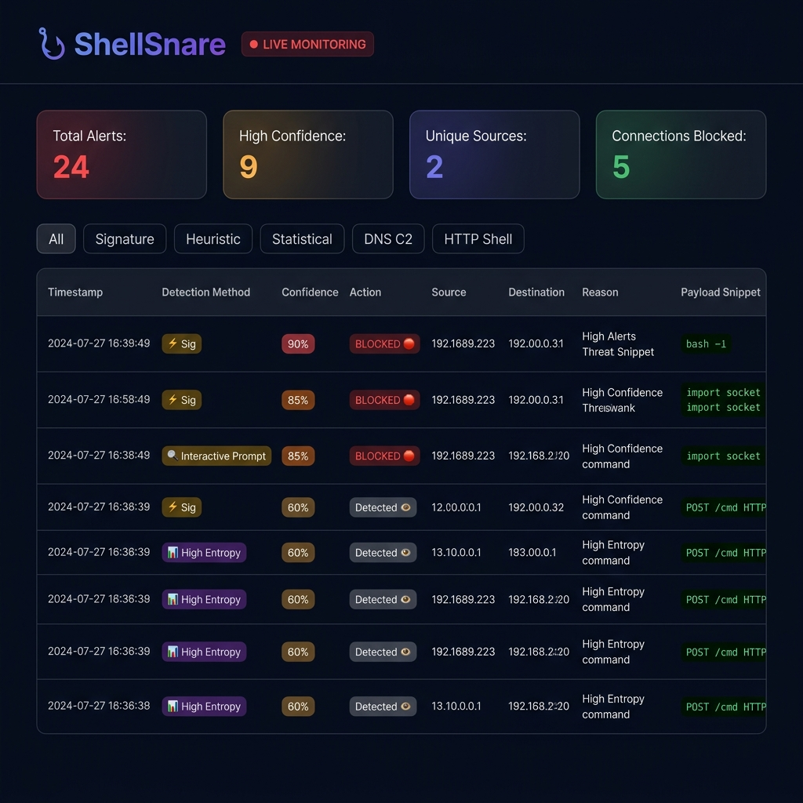
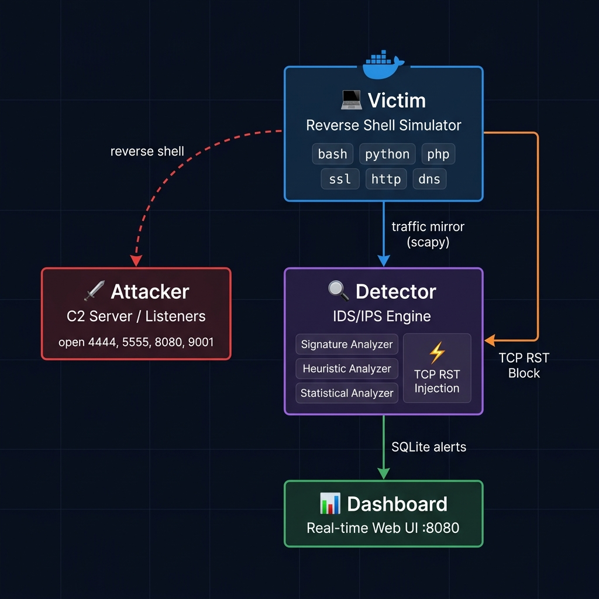

<div align="center">

# 🪤 ShellSnare

**A containerized Intrusion Detection & Prevention System (IDS/IPS) for reverse shell attacks**

[](https://python.org)
[](https://docker.com)
[](https://scapy.net)
[](LICENSE)

ShellSnare is a fully self-contained cybersecurity lab that **simulates, detects, and actively blocks** reverse shell attacks using live packet analysis. Built with Docker, Python, and Scapy — runs entirely on your local machine.



</div>

---

## 🧠 How It Works

ShellSnare creates an isolated Docker network with four containers that communicate with each other in a controlled attack simulation:



| Container | Role | Stack |
|-----------|------|-------|
| 🗡️ **Attacker** | Listens for incoming reverse shells on multiple ports; acts as a C2 server | Netcat, Socat, Python |
| 💻 **Victim** | Executes reverse shell payloads on demand via an interactive launcher | Bash, Python, PHP, Socat |
| 🔎 **Detector** | Sniffs all traffic on the network, analyzes packets, and injects TCP RST to block connections | Python, Scapy, SQLite |
| 📊 **Dashboard** | Serves a real-time web UI showing detections and blocked connections | Flask, HTML/CSS/JS |

---

## ✨ Features

### 🔍 Three-Layer Detection Engine
- **Signature-Based** — Pattern matches against known payloads (`bash -i`, `import socket`, `fsockopen`, `nc -e`, etc.)
- **Heuristic Analysis** — Detects interactive shell prompts, suspicious ports, small bidirectional packet patterns, and DNS C2 beacons
- **Statistical Analysis** — Flags high Shannon entropy (encrypted shells), large HTTP payload exfiltration, and abnormal byte ratios

### 🛑 Active IPS — TCP RST Injection
When a connection is detected with **≥ 85% confidence**, ShellSnare forges and injects TCP RST packets in both directions using Scapy, **instantly severing the attacker's connection**.

### 🎛️ 6 Simulated Shell Types

| Shell Type | Protocol | Detection Challenge |
|------------|----------|-------------------|
| Bash TCP | Raw TCP | 🟢 Easy |
| Python Socket | Raw TCP | 🟡 Medium |
| PHP `fsockopen` | Raw TCP | 🟡 Medium |
| HTTP Reverse Shell | HTTP w/ custom header | 🟡 Medium |
| Socat SSL/TLS | Encrypted TCP | 🔴 Hard |
| DNS C2 Tunnel | DNS TXT queries | 🔴 Hard |

### 📊 Real-Time Dashboard
- Live alert table with auto-refresh
- **BLOCKED 🛑** / **Detected 👁️** action badges per alert
- Confidence scoring (Low / Medium / High)
- Filterable by detection method (Signature, Heuristic, Statistical, DNS C2, HTTP Shell)
- 4 live stat cards: Total Alerts, High Confidence, Unique Sources, Connections Blocked

---

## 🚀 Quick Start

### Prerequisites
- [Docker](https://docs.docker.com/get-docker/) v20.10+
- [Docker Compose](https://docs.docker.com/compose/) v2.0+

### 1. Clone & Start

```bash
git clone https://github.com/yourusername/shellsnare.git
cd shellsnare
docker compose up --build -d
```

### 2. Open the Dashboard

Visit **http://localhost:8080** in your browser.

### 3. Launch a Reverse Shell

```bash
# Open a shell on the victim container
docker exec -it shellsnare-victim python3 launcher.py
```

You'll see an interactive menu:

```
╔═════════════════════════════════════════╗
║  🪤  ShellSnare — Shell Launcher        ║
╠═════════════════════════════════════════╣
║  1. Bash TCP Reverse Shell              ║
║  2. Python Socket Shell                 ║
║  3. PHP Reverse Shell                   ║
║  4. HTTP Reverse Shell (beacon)         ║
║  5. SSL Encrypted Shell (socat)         ║
║  6. DNS C2 Tunnel                       ║
║  7. Fire All Simulators                 ║
║  0. Exit                                ║
╚═════════════════════════════════════════╝
```

Pick any shell type and watch the dashboard light up with detections in real time.

### 4. Tear Down

```bash
docker compose down
```

---

## 📁 Project Structure

```
shellsnare/
├── docker-compose.yml          # Orchestrates all 4 containers on an isolated network
├── docs/                       # Screenshots and diagrams
│
├── attacker/
│   ├── Dockerfile
│   ├── listener.sh             # Basic netcat listener
│   └── scripts/
│       ├── ssl_listener.sh     # Socat SSL/TLS listener
│       ├── multi_listener.sh   # Binds all ports simultaneously
│       └── dns_server.py       # Minimal DNS C2 server
│
├── victim/
│   ├── Dockerfile
│   ├── launcher.py             # Interactive shell launcher menu
│   └── scripts/
│       ├── ssl_reverse.sh      # Socat encrypted reverse shell
│       ├── python_reverse.py   # Python socket reverse shell
│       ├── php_reverse.sh      # PHP fsockopen reverse shell
│       └── http_reverse.sh     # HTTP beacon shell
│
├── detector/
│   ├── Dockerfile
│   ├── detector.py             # Main sniffing loop + IPS trigger
│   ├── ips.py                  # TCP RST injection module (Scapy)
│   ├── config.py               # Thresholds and constants
│   ├── models.py               # SQLite schema and helpers
│   └── analyzers/
│       ├── signature.py        # Payload pattern matching
│       ├── heuristic.py        # Behavioral indicators
│       └── statistical.py      # Entropy, packet size analysis
│
└── dashboard/
    ├── Dockerfile
    ├── app.py                  # Flask API server
    └── templates/
        └── index.html          # Single-page glassmorphism UI
```

---

## ⚙️ Configuration

All detection thresholds are tunable in [`detector/config.py`](detector/config.py):

```python
CONFIDENCE_LOW    = 0.30   # Log only
CONFIDENCE_MEDIUM = 0.60   # Highlight in dashboard
CONFIDENCE_HIGH   = 0.85   # Trigger IPS (TCP RST injection)

ENTROPY_THRESHOLD = 5.0    # Shannon bits/byte — flags encrypted shells
SHELL_PORTS = [4444, 5555, 8080, 9001, 1337, 31337]  # Suspicious outbound ports
```

---

## 🛠️ Tech Stack

| Layer | Technology |
|-------|-----------|
| Container orchestration | Docker Compose |
| Packet capture & injection | [Scapy](https://scapy.net) |
| Detection algorithms | Python (regex, entropy, heuristics) |
| Data persistence | SQLite |
| Web backend | Flask |
| Web frontend | Vanilla HTML/CSS/JS (glassmorphism UI) |

---

## ⚠️ Disclaimer

This project is for **educational and research purposes only**.

All simulations run within isolated Docker containers on your local machine. Do not use any of these techniques against systems you do not own or have explicit permission to test. Unauthorized access to computer systems is illegal.

---

## 📄 License

[MIT](LICENSE) — free to use, modify, and distribute.

---

<div align="center">
Built with ☕ and way too much interest in network security
</div>
